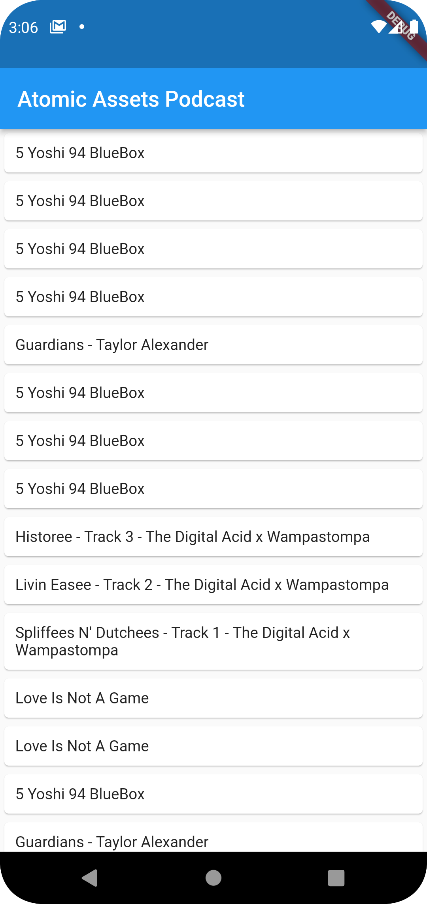
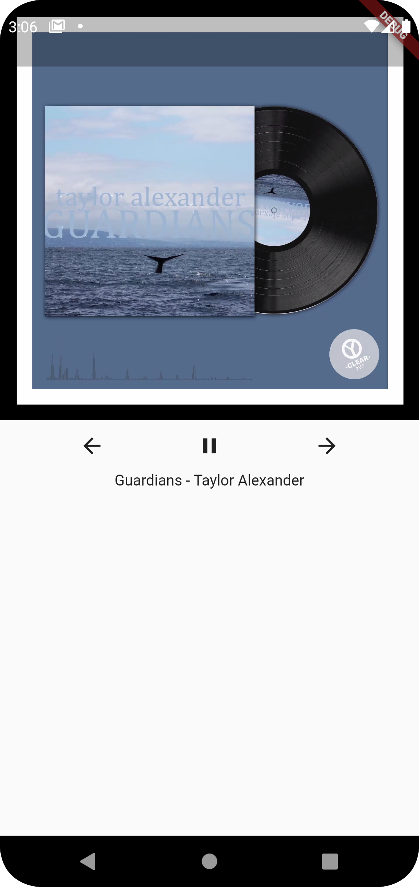

# atomic_assets

A Flutter project demonstrating querying an API and playing a video retrieved from IPFS.
State management accomplished with ChangeNotifierProvider and setState(). 
Next song plays when current is complete.

## Getting Started

* This is just a standard Flutter project that can be opened in Android Studio or VS Code.

   
